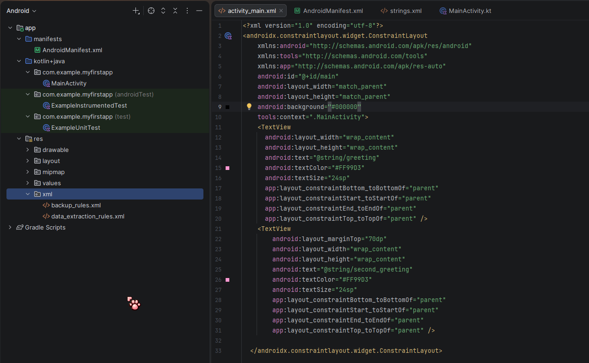

# Лабораторная работа №1

<div align="center">

**МИНИСТЕРСТВО НАУКИ И ВЫСШЕГО ОБРАЗОВАНИЯ РОССИЙСКОЙ ФЕДЕРАЦИИ**

**ФЕДЕРАЛЬНОЕ ГОСУДАРСТВЕННОЕ БЮДЖЕТНОЕ ОБРАЗОВАТЕЛЬНОЕ УЧРЕЖДЕНИЕ ВЫСШЕГО ОБРАЗОВАНИЯ**

**«САХАЛИНСКИЙ ГОСУДАРСТВЕННЫЙ УНИВЕРСИТЕТ»**

<br>
<br>

Институт естественных наук и техносферной безопасности

Кафедра информатики

**Пахомов Виктор Васильевич**

<br>
<br>
<br>
<br>

Лабораторная работа №1

**«MyFirstApp»**

01.03.02 Прикладная математика и информатика

3 Курс

<br>
<br>
<br>
<br>
<br>
<br>
<br>
<br>
<br>
<br>
<br>
<br>
<br>

<div align="right">
Научный руководитель<br>
Соболев Евгений Игоревич
</div>

<br>
<br>
<br>

г. Южно-Сахалинск

2026 г.

</div>

---  

## Цель Работы

Изучить структуру Android-проекта в среде разработки Android Studio, освоить процесс создания и модификации пользовательского интерфейса, научиться запускать приложение на эмуляторе, а также закрепить навыки работы с файлами ресурсов.

## Скриншоты
  
<br>


## Listing
```xml
<?xml version="1.0" encoding="utf-8"?>
<androidx.constraintlayout.widget.ConstraintLayout
    xmlns:android="http://schemas.android.com/apk/res/android"
    xmlns:tools="http://schemas.android.com/tools"
    xmlns:app="http://schemas.android.com/apk/res-auto"
    android:id="@+id/main"
    android:layout_width="match_parent"
    android:layout_height="match_parent"
    android:background="#000000"
    tools:context=".MainActivity">
    <TextView
      android:layout_width="wrap_content"
      android:layout_height="wrap_content"
      android:text="@string/greeting"
      android:textColor="#FF99D3"
      android:textSize="24sp"
      app:layout_constraintBottom_toBottomOf="parent"
      app:layout_constraintStart_toStartOf="parent"
      app:layout_constraintEnd_toEndOf="parent"
      app:layout_constraintTop_toTopOf="parent" />
    <TextView
        android:layout_marginTop="70dp"
        android:layout_width="wrap_content"
        android:layout_height="wrap_content"
        android:text="@string/second_greeting"
        android:textColor="#FF99D3"
        android:textSize="24sp"
        app:layout_constraintBottom_toBottomOf="parent"
        app:layout_constraintStart_toStartOf="parent"
        app:layout_constraintEnd_toEndOf="parent"
        app:layout_constraintTop_toTopOf="parent" />

  </androidx.constraintlayout.widget.ConstraintLayout>
  ```

## Ответы на контрольные вопросы
Вот обновленные ответы на контрольные вопросы, составленные с использованием предоставленной теоретической справки:

**1. Какие основные компоненты входят в структуру Android-проекта?**
Основные компоненты структуры проекта в Android Studio:
- **`Manifests`** — содержит файл `AndroidManifest.xml`, описывающий приложение.
- **`Java` / `Kotlin`** — папка с исходным кодом (активности, классы и логика приложения).
- **`Res` (Resources)** — папка с ресурсами: разметки (`layout`), изображения (`drawable`), строки (`values/strings.xml`), темы (`values/styles.xml`) и цвета.
- **`Gradle Scripts`** — файлы сборки (например, `build.gradle`) для настройки зависимостей и параметров компиляции.

**2. Для чего нужен файл AndroidManifest.xml?**  
`AndroidManifest.xml` необходим для описания приложения. Он содержит важную информацию для операционной системы: имя приложения, иконку, список активностей (экранов), а также запрашиваемые разрешения.

**3. Чем отличается minSdkVersion от targetSdkVersion?**  
- **`minSdkVersion`** — минимальная версия Android, на которой приложение может быть установлено и работать.
- **`targetSdkVersion`** — версия Android, на которой приложение тестировалось и для которой оно оптимизировано. Приложение может работать и на более новых версиях, но система может включать механизмы обратной совместимости, если версия ниже `targetSdkVersion`.

**4. Что такое AVD и для чего он используется?**  
**AVD** (Android Virtual Device) — это конфигурация виртуального устройства Android (эмулятор). Он используется для запуска и тестирования приложений прямо на компьютере без необходимости иметь реальное физическое устройство (телефон или планшет).

**5. Как изменить текст приложения без изменения кода активности?**  
Чтобы изменить текст без изменения кода активности, нужно использовать ресурсы. Текст выносится в файл **`strings.xml`** (находится в папке `res/values/`). В коде разметки (`layout`) или в Java/Kotlin файле используется ссылка на строковый ресурс (например, `@string/имя_строки`). Таким образом, для смены текста достаточно отредактировать только файл `strings.xml`.

## Вывод

В ходе работы был сделан MyFirstApp

В процессе работы была изучена структура Android-проекта в среде разработки Android Studio, рассмотрено назначение основных компонентов:`AndroidManifest.xml`, папки с ресурсами `res` и файлов сборки Gradle. Было создано виртуальное устройство (AVD) для тестирования приложения.

Основная часть работы заключалась в модификации пользовательского интерфейса: был изменен файл разметки `activity_main.xml`.Был добавлен второй текстовый элемент (`TextView`), изменены цвета и размеры шрифтов. Текстовые надписи были вынесены в файл строковых ресурсов `strings.xml`, что позволяет в будущем легко изменять текст приложения без правки кода.

Итоговое приложение было успешно запущено на эмуляторе AVD, что подтверждает корректность написанного кода и правильность настроек проекта.

## Authors

- [@MaJaStudy](https://github.com/MaJaStudy)
    - <sub><ins>Пахомов Виктор Васильевич №331</ins></sub>
