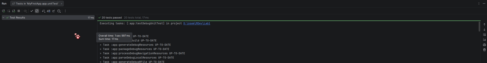
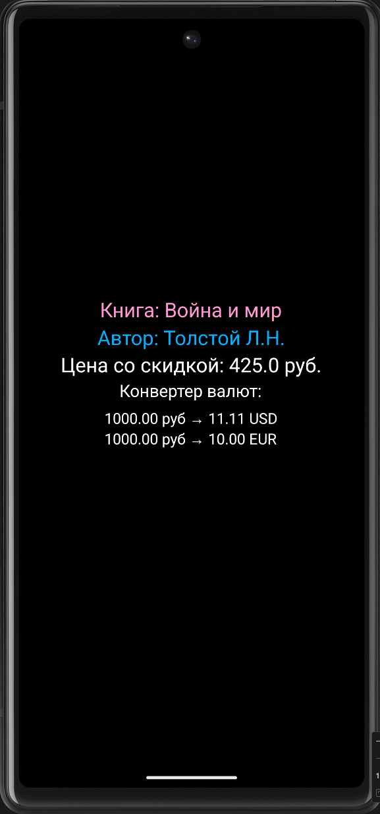
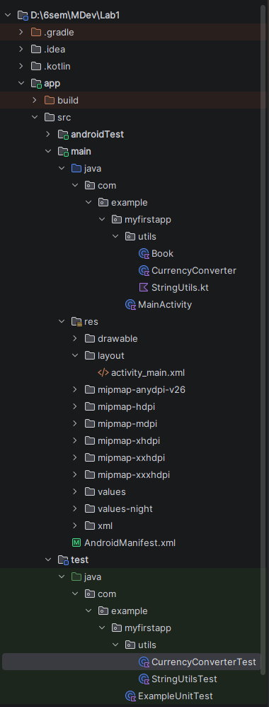

# Лабораторная работа №2

<div align="center">

**МИНИСТЕРСТВО НАУКИ И ВЫСШЕГО ОБРАЗОВАНИЯ РОССИЙСКОЙ ФЕДЕРАЦИИ**  
**ФЕДЕРАЛЬНОЕ ГОСУДАРСТВЕННОЕ БЮДЖЕТНОЕ ОБРАЗОВАТЕЛЬНОЕ УЧРЕЖДЕНИЕ ВЫСШЕГО ОБРАЗОВАНИЯ**  
**«САХАЛИНСКИЙ ГОСУДАРСТВЕННЫЙ УНИВЕРСИТЕТ»**

<br>
<br>

Институт естественных наук и техносферной безопасности  
Кафедра информатики  
**Пахомов Виктор Васильевич**

<br>
<br>
<br>
<br>

Лабораторная работа №2  
**«Написание консольных утилит на Kotlin внутри Android проекта. Расчеты, работа со строками. Подготовка классов данных для будущего приложения»**  
01.03.02 Прикладная математика и информатика  
3 Курс

<br>
<br>
<br>
<br>
<br>
<br>
<br>
<br>
<br>
<br>
<br>
<br>
<br>

<div align="right">
Научный руководитель<br>
Соболев Евгений Игоревич
</div>

<br>
<br>
<br>

г. Южно-Сахалинск  
2026 г.

</div>

---

## Цель Работы

Научиться создавать классы данных и функции-утилиты на Kotlin в контексте Android-проекта, освоить базовые приёмы работы со строками и числами, познакомиться с юнит-тестированием для проверки корректности кода.

## Индивидуальное задание: Конвертер валют

Было выбрано индивидуальное задание **«Конвертер валют»**. Требовалось написать функции конвертации рублей в доллары и евро по заданному курсу, создать класс `CurrencyConverter` с соответствующими методами и покрыть его тестами.

## Скриншоты

  
*Рисунок 1 – Успешное прохождение всех юнит-тестов*

<br>

  
*Рисунок 2 – Демонстрация работы конвертера в интерфейсе приложения*

<br>


*Рисунок 3 – Структура проекта с пакетом utils и тестами*

## Листинги

### 1. Класс данных Book (`Book.kt`)

```kotlin
package com.example.myfirstapp.utils

data class Book(
    val title: String,
    val author: String,
    val year: Int,
    val price: Double
)
```

### 2. Утилиты для работы со строками (`StringUtils.kt`)

```kotlin
package com.example.myfirstapp.utils

// Проверка, что строка похожа на email (содержит @ и .)
fun String.isValidEmail(): Boolean {
    return this.contains("@") && this.contains(".")
}

// Форматирование автора: "Толстой Л.Н."
fun formatAuthorName(fullName: String): String {
    val parts = fullName.split(" ").filter { it.isNotBlank() }
    return when (parts.size) {
        1 -> parts[0]  // только фамилия
        2 -> "${parts[0]} ${parts[1].first()}."  // фамилия и инициал
        3 -> "${parts[0]} ${parts[1].first()}.${parts[2].first()}."  // фамилия и два инициала
        else -> fullName
    }
}

// Применение скидки к цене книги
fun applyDiscount(price: Double, discountPercent: Double): Double {
    require(discountPercent in 0.0..100.0) { "Скидка должна быть от 0 до 100" }
    return price * (1 - discountPercent / 100)
}
```

### 3. Класс CurrencyConverter (`CurrencyConverter.kt`)

```kotlin
package com.example.myfirstapp.utils

class CurrencyConverter(
    private val usdRate: Double,
    private val eurRate: Double
) {
    fun rubToUsd(rub: Double): Double {
        require(rub >= 0) { "Сумма не может быть отрицательной" }
        return rub / usdRate
    }
    fun usdToRub(usd: Double): Double {
        require(usd >= 0) { "Сумма не может быть отрицательной" }
        return usd * usdRate
    }
    fun rubToEur(rub: Double): Double {
        require(rub >= 0) { "Сумма не может быть отрицательной" }
        return rub / eurRate
    }
    fun eurToRub(eur: Double): Double {
        require(eur >= 0) { "Сумма не может быть отрицательной" }
        return eur * eurRate
    }
    fun usdToEur(usd: Double): Double {
        require(usd >= 0) { "Сумма не может быть отрицательной" }
        val rub = usdToRub(usd)
        return rubToEur(rub)
    }
    fun eurToUsd(eur: Double): Double {
        require(eur >= 0) { "Сумма не может быть отрицательной" }
        val rub = eurToRub(eur)
        return rubToUsd(rub)
    }
}
```

### 4. Тесты для StringUtils (`StringUtilsTest.kt`)

```kotlin
package com.example.myfirstapp.utils

import org.junit.Assert.*
import org.junit.Test

class StringUtilsTest {

    @Test
    fun emailValidation_correct() {
        assertTrue("test@example.com".isValidEmail())
        assertTrue("user.name@domain.co".isValidEmail())
    }

    @Test
    fun emailValidation_incorrect() {
        assertFalse("testexample.com".isValidEmail())
        assertFalse("test@example".isValidEmail())
        assertFalse("".isValidEmail())
    }

    @Test
    fun formatAuthorName_fullName() {
        assertEquals("Толстой Л.Н.", formatAuthorName("Толстой Лев Николаевич"))
        assertEquals("Пушкин А.С.", formatAuthorName("Пушкин Александр Сергеевич"))
    }

    @Test
    fun formatAuthorName_twoParts() {
        assertEquals("Толстой Л.", formatAuthorName("Толстой Лев"))
        assertEquals("Пушкин А.", formatAuthorName("Пушкин Александр"))
    }

    @Test
    fun formatAuthorName_onePart() {
        assertEquals("Толстой", formatAuthorName("Толстой"))
    }

    @Test
    fun applyDiscount_normal() {
        assertEquals(90.0, applyDiscount(100.0, 10.0), 0.001)
        assertEquals(75.0, applyDiscount(150.0, 50.0), 0.001)
    }

    @Test
    fun applyDiscount_zero() {
        assertEquals(100.0, applyDiscount(100.0, 0.0), 0.001)
    }

    @Test(expected = IllegalArgumentException::class)
    fun applyDiscount_invalidLow() {
        applyDiscount(100.0, -5.0)
    }

    @Test(expected = IllegalArgumentException::class)
    fun applyDiscount_invalidHigh() {
        applyDiscount(100.0, 110.0)
    }
}
```

### 5. Тесты для CurrencyConverter (`CurrencyConverterTest.kt`)

```kotlin
package com.example.myfirstapp.utils

import org.junit.Assert.*
import org.junit.Before
import org.junit.Test

class CurrencyConverterTest {

    private lateinit var converter: CurrencyConverter

    @Before
    fun setUp() {
        // Инициализация перед каждым тестом
        // Курсы: 1 USD = 90 RUB, 1 EUR = 100 RUB
        converter = CurrencyConverter(90.0, 100.0)
    }

    @Test
    fun rubToUsd_positiveAmount() {
        val result = converter.rubToUsd(180.0)
        assertEquals(2.0, result, 0.001)
    }

    @Test
    fun rubToUsd_zeroAmount() {
        val result = converter.rubToUsd(0.0)
        assertEquals(0.0, result, 0.001)
    }

    @Test(expected = IllegalArgumentException::class)
    fun rubToUsd_negativeAmount() {
        converter.rubToUsd(-100.0)
    }

    @Test
    fun usdToRub_positiveAmount() {
        val result = converter.usdToRub(5.0)
        assertEquals(450.0, result, 0.001)
    }

    @Test
    fun rubToEur_positiveAmount() {
        val result = converter.rubToEur(250.0)
        assertEquals(2.5, result, 0.001)
    }

    @Test
    fun eurToRub_positiveAmount() {
        val result = converter.eurToRub(3.0)
        assertEquals(300.0, result, 0.001)
    }

    @Test
    fun usdToEur_positiveAmount() {
        val result = converter.usdToEur(100.0)
        // 100 USD = 9000 RUB = 90 EUR
        assertEquals(90.0, result, 0.001)
    }

    @Test
    fun eurToUsd_positiveAmount() {
        val result = converter.eurToUsd(100.0)
        // 100 EUR = 10000 RUB = 111.111... USD
        assertEquals(111.111, result, 0.001)
    }

    @Test
    fun multipleConversions_shouldReturnOriginalValue() {
        val rubAmount = 1000.0
        val usdAmount = converter.rubToUsd(rubAmount)
        val rubBack = converter.usdToRub(usdAmount)
        assertEquals(rubAmount, rubBack, 0.001)
    }

    @Test
    fun differentExchangeRates() {
        val customConverter = CurrencyConverter(75.0, 85.0)
        assertEquals(2.0, customConverter.rubToUsd(150.0), 0.001)
        assertEquals(150.0, customConverter.usdToRub(2.0), 0.001)
    }
}
```

### 6. Разметка activity_main.xml

```xml
<?xml version="1.0" encoding="utf-8"?>
<androidx.constraintlayout.widget.ConstraintLayout
    xmlns:android="http://schemas.android.com/apk/res/android"
    xmlns:tools="http://schemas.android.com/tools"
    xmlns:app="http://schemas.android.com/apk/res-auto"
    android:id="@+id/main"
    android:layout_width="match_parent"
    android:layout_height="match_parent"
    android:background="#000000"
    tools:context=".MainActivity">

    <TextView
        android:id="@+id/textView1"
        android:layout_width="wrap_content"
        android:layout_height="wrap_content"
        android:text="@string/greeting"
        android:textColor="#FF99D3"
        android:textSize="24sp"
        app:layout_constraintBottom_toBottomOf="parent"
        app:layout_constraintEnd_toEndOf="parent"
        app:layout_constraintHorizontal_bias="0.497"
        app:layout_constraintStart_toStartOf="parent"
        app:layout_constraintTop_toTopOf="parent"
        app:layout_constraintVertical_bias="0.366" />

    <TextView
        android:id="@+id/textView3"
        android:layout_width="wrap_content"
        android:layout_height="wrap_content"
        android:layout_marginTop="140dp"
        android:text="Загрузка..."
        android:textColor="#FFFFFF"
        android:textSize="24sp"
        app:layout_constraintBottom_toBottomOf="parent"
        app:layout_constraintEnd_toEndOf="parent"
        app:layout_constraintHorizontal_bias="0.496"
        app:layout_constraintStart_toStartOf="parent"
        app:layout_constraintTop_toTopOf="parent"
        app:layout_constraintVertical_bias="0.332" />

    <TextView
        android:id="@+id/textView4"
        android:layout_width="wrap_content"
        android:layout_height="wrap_content"
        android:layout_marginTop="210dp"
        android:text="Конвертер валют"
        android:textColor="#FFFFFF"
        android:textSize="20sp"
        app:layout_constraintBottom_toBottomOf="parent"
        app:layout_constraintEnd_toEndOf="parent"
        app:layout_constraintHorizontal_bias="0.495"
        app:layout_constraintStart_toStartOf="parent"
        app:layout_constraintTop_toTopOf="parent"
        app:layout_constraintVertical_bias="0.309" />

    <TextView
        android:id="@+id/textView5"
        android:layout_width="wrap_content"
        android:layout_height="wrap_content"
        android:layout_marginTop="250dp"
        android:text="..."
        android:textColor="#FFFFFF"
        android:textSize="18sp"
        app:layout_constraintBottom_toBottomOf="parent"
        app:layout_constraintEnd_toEndOf="parent"
        app:layout_constraintHorizontal_bias="0.496"
        app:layout_constraintStart_toStartOf="parent"
        app:layout_constraintTop_toTopOf="parent"
        app:layout_constraintVertical_bias="0.332" />

    <TextView
        android:id="@+id/textView2"
        android:layout_width="wrap_content"
        android:layout_height="wrap_content"
        android:layout_marginTop="70dp"
        android:text="@string/second_greeting"
        android:textColor="#02B0FF"
        android:textSize="24sp"
        app:layout_constraintBottom_toBottomOf="parent"
        app:layout_constraintEnd_toEndOf="parent"
        app:layout_constraintHorizontal_bias="0.498"
        app:layout_constraintStart_toStartOf="parent"
        app:layout_constraintTop_toTopOf="parent"
        app:layout_constraintVertical_bias="0.351" />

</androidx.constraintlayout.widget.ConstraintLayout>
```

### 7. MainActivity.kt

```kotlin
package com.example.myfirstapp

import android.os.Bundle
import android.widget.TextView
import androidx.activity.enableEdgeToEdge
import androidx.appcompat.app.AppCompatActivity
import androidx.core.view.ViewCompat
import androidx.core.view.WindowInsetsCompat
import com.example.myfirstapp.utils.Book
import com.example.myfirstapp.utils.formatAuthorName
import com.example.myfirstapp.utils.applyDiscount
import com.example.myfirstapp.utils.CurrencyConverter

class MainActivity : AppCompatActivity() {
    override fun onCreate(savedInstanceState: Bundle?) {
        super.onCreate(savedInstanceState)
        enableEdgeToEdge()
        setContentView(R.layout.activity_main)
        ViewCompat.setOnApplyWindowInsetsListener(findViewById(R.id.main)) { v, insets ->
            val systemBars = insets.getInsets(WindowInsetsCompat.Type.systemBars())
            v.setPadding(systemBars.left, systemBars.top, systemBars.right, systemBars.bottom)
            insets
        }

        val book = Book("Война и мир", "Толстой Лев Николаевич", 1869, 500.0)
        val formattedAuthor = formatAuthorName(book.author)
        val discountedPrice = applyDiscount(book.price, 15.0)

        findViewById<TextView>(R.id.textView1).text = "Книга: ${book.title}"
        findViewById<TextView>(R.id.textView2).text = "Автор: $formattedAuthor"
        findViewById<TextView>(R.id.textView3).text = "Цена со скидкой: $discountedPrice руб."

        val converter = CurrencyConverter(90.0, 100.0) // 1 USD = 90 RUB, 1 EUR = 100 RUB
        val rubAmount = 1000.0

        val usdAmount = converter.rubToUsd(rubAmount)
        val eurAmount = converter.rubToEur(rubAmount)

        val rubFormat = "%.2f руб".format(rubAmount)
        val usdFormat = "%.2f USD".format(usdAmount)
        val eurFormat = "%.2f EUR".format(eurAmount)

        findViewById<TextView>(R.id.textView4).text = "Конвертер валют:"
        findViewById<TextView>(R.id.textView5).text = "$rubFormat → $usdFormat\n$rubFormat → $eurFormat"
    }
}
```

## Ответы на контрольные вопросы

**1. Для чего в Kotlin используются data class?**  
Data class (классы данных) используются для хранения состояния. Компилятор автоматически генерирует для них полезные методы: `toString()`, `equals()`, `hashCode()` и `copy()`. Это избавляет от необходимости писать шаблонный код и делает классы удобными для хранения данных, например, для модели `Book` с полями title, author, year, price.

**2. Чем отличается функция расширения от обычной функции?**  
Функция расширения (extension function) позволяет добавить новую функциональность к существующему классу без наследования. Она вызывается как метод класса (например, `"test".isValidEmail()`), но при этом не может обращаться к приватным полям класса. Обычная функция — это независимая функция, не привязанная к конкретному классу и вызываемая обычным способом (например, `formatAuthorName("Толстой Лев")`).

**3. Как запустить юнит-тесты в Android Studio?**  
Существует несколько способов:
- Щелкнуть правой кнопкой мыши на папке `src/test/java` и выбрать **Run Tests**
- Открыть конкретный тестовый файл и нажать на зелёный треугольник рядом с именем класса или отдельным тестом
- Через терминал выполнить команду `./gradlew test`
Внизу откроется окно **Run** с результатами выполнения тестов.

**4. Что такое assertEquals и для чего нужен третий параметр (дельта) при сравнении вещественных чисел?**  
`assertEquals` — это метод библиотеки JUnit для проверки равенства двух значений в тестах. Третий параметр (дельта) используется при сравнении вещественных чисел (Double, Float) из-за особенностей их представления в компьютере. Из-за погрешностей вычислений 0.1 + 0.2 может быть не точно равно 0.3. Дельта задаёт допустимую погрешность (например, 0.001), в пределах которой числа считаются равными.

**5. В какой директории проекта хранятся тесты, выполняющиеся на JVM?**  
Тесты, выполняющиеся на JVM, хранятся в директории `app/src/test/java/`. Эта директория предназначена для юнит-тестов, которые запускаются на локальной машине без необходимости эмулятора или реального устройства.

## Вывод

В ходе лабораторной работы был создан набор утилит для работы со строками и числами в Android-проекте.

Были изучены и применены на практике:
- **Классы данных (data class)** — создан класс `Book` для хранения информации о книге
- **Функции расширения** — реализована функция `isValidEmail()` как расширение для String
- **Обработка строк** — реализовано форматирование ФИО автора в формат "Фамилия И.О."
- **Математические расчёты** — созданы функции для применения скидки и конвертации валют
- **Обработка исключений** — использована функция `require` для валидации входных данных

Особое внимание было уделено **юнит-тестированию**:
- Созданы тестовые классы `StringUtilsTest` и `CurrencyConverterTest`
- Написано 20 тестов, покрывающих нормальные, граничные и исключительные ситуации
- Все тесты успешно выполняются (зелёная полоса), что подтверждает корректность реализованных функций

Для индивидуального задания **«Конвертер валют»** был разработан класс `CurrencyConverter` с шестью методами конвертации (RUB↔USD, RUB↔EUR, USD↔EUR через кросс-курс). Реализована проверка на отрицательные суммы через `require`. Написано 12 тестов, проверяющих все методы конвертера.

В интерфейс приложения были выведены результаты работы утилит: информация о книге со скидкой и конвертация 1000 рублей в доллары и евро. Приложение успешно запускается на эмуляторе и корректно отображает все данные.

Таким образом, цель работы достигнута: получены практические навыки создания классов данных, функций-утилит и юнит-тестов в контексте Android-разработки на Kotlin.

## Authors

- [@MaJaStudy](https://github.com/MaJaStudy)
    - <sub><ins>Пахомов Виктор Васильевич №331</ins></sub>
