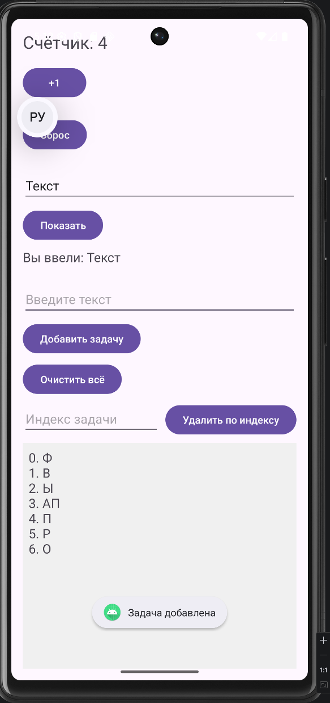
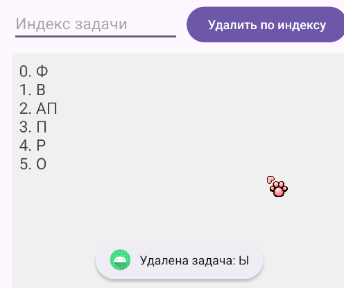
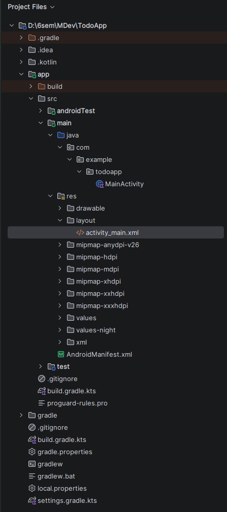

# Лабораторная работа №5

<div align="center">

**МИНИСТЕРСТВО НАУКИ И ВЫСШЕГО ОБРАЗОВАНИЯ РОССИЙСКОЙ ФЕДЕРАЦИИ**  
**ФЕДЕРАЛЬНОЕ ГОСУДАРСТВЕННОЕ БЮДЖЕТНОЕ ОБРАЗОВАТЕЛЬНОЕ УЧРЕЖДЕНИЕ ВЫСШЕГО ОБРАЗОВАНИЯ**  
**«САХАЛИНСКИЙ ГОСУДАРСТВЕННЫЙ УНИВЕРСИТЕТ»**

<br>
<br>

Институт естественных наук и техносферной безопасности  
Кафедра информатики  
**Пахомов Виктор Васильевич**

<br>
<br>
<br>
<br>

Лабораторная работа №5  
**«Счетчик нажатий, поле ввода и отображение текста. Реализация ToDo-списка»**  
01.03.02 Прикладная математика и информатика  
3 Курс

<br>
<br>
<br>
<br>
<br>
<br>
<br>
<br>
<br>
<br>
<br>
<br>
<br>

<div align="right">
Научный руководитель<br>
Соболев Евгений Игоревич
</div>

<br>
<br>
<br>

г. Южно-Сахалинск  
2026 г.

</div>

---

## Цель Работы

Научиться обрабатывать пользовательский ввод, работать с состоянием приложения (счетчик, список задач) и динамически обновлять интерфейс Android-приложения на языке Kotlin.

## Индивидуальное задание

В рамках работы было выполнено задание **«Удаление задач»**:
- Добавлено второе поле ввода для указания индекса задачи.
- Добавлена кнопка **«Удалить по индексу»**.
- При нажатии задача с указанным индексом (начиная с 0) удаляется из списка с проверкой границ и выводом соответствующего уведомления.

## Скриншоты

  
*Рисунок 1 – Главный экран приложения со счетчиком, полем ввода и списком задач*

<br>

  
*Рисунок 2 – Удаление второй задачи (индекс 1) из списка*

<br>

  
*Рисунок 3 – Структура проекта в Android Studio*

## Листинги

### 1. Файл разметки `activity_main.xml`

```xml
<?xml version="1.0" encoding="utf-8"?>
<LinearLayout xmlns:android="http://schemas.android.com/apk/res/android"
    android:layout_width="match_parent"
    android:layout_height="match_parent"
    android:orientation="vertical"
    android:padding="16dp">

    <!-- Блок 1: Счётчик -->
    <TextView
        android:id="@+id/textCounter"
        android:layout_width="wrap_content"
        android:layout_height="wrap_content"
        android:text="@string/counter_text"
        android:textSize="24sp"
        android:layout_marginBottom="16dp"/>

    <Button
        android:id="@+id/buttonIncrement"
        android:layout_width="wrap_content"
        android:layout_height="wrap_content"
        android:text="@string/button_increment"
        android:layout_marginBottom="24dp"/>

    <Button
        android:id="@+id/buttonReset"
        android:layout_width="wrap_content"
        android:layout_height="wrap_content"
        android:text="Сброс"
        android:layout_marginBottom="24dp"/>

    <!-- Блок 2: Ввод и отображение текста -->
    <EditText
        android:id="@+id/editTextInput"
        android:layout_width="match_parent"
        android:layout_height="wrap_content"
        android:hint="@string/hint_input"
        android:inputType="text"
        android:layout_marginBottom="8dp"/>

    <Button
        android:id="@+id/buttonShow"
        android:layout_width="wrap_content"
        android:layout_height="wrap_content"
        android:text="@string/button_show"
        android:layout_marginBottom="8dp"/>

    <TextView
        android:id="@+id/textEntered"
        android:layout_width="wrap_content"
        android:layout_height="wrap_content"
        android:text="@string/label_entered"
        android:textSize="18sp"
        android:layout_marginBottom="24dp"/>

    <!-- Блок 3: ToDo List -->
    <EditText
        android:id="@+id/editTextTask"
        android:layout_width="match_parent"
        android:layout_height="wrap_content"
        android:hint="@string/hint_input"
        android:inputType="text"
        android:layout_marginBottom="8dp"/>

    <Button
        android:id="@+id/buttonAddTask"
        android:layout_width="wrap_content"
        android:layout_height="wrap_content"
        android:text="@string/button_add_task"
        android:layout_marginBottom="8dp"/>

    <Button
        android:id="@+id/buttonClearAll"
        android:layout_width="wrap_content"
        android:layout_height="wrap_content"
        android:text="Очистить всё"
        android:layout_marginBottom="8dp"/>

    <!-- Поле для индекса и кнопка удаления -->
    <LinearLayout
        android:layout_width="match_parent"
        android:layout_height="wrap_content"
        android:orientation="horizontal"
        android:layout_marginBottom="8dp">

        <EditText
            android:id="@+id/editTextIndex"
            android:layout_width="0dp"
            android:layout_height="wrap_content"
            android:layout_weight="1"
            android:hint="Индекс задачи"
            android:inputType="number"
            android:layout_marginEnd="8dp"/>

        <Button
            android:id="@+id/buttonDeleteTask"
            android:layout_width="wrap_content"
            android:layout_height="wrap_content"
            android:text="Удалить по индексу"/>
    </LinearLayout>

    <TextView
        android:id="@+id/textTasks"
        android:layout_width="match_parent"
        android:layout_height="0dp"
        android:layout_weight="1"
        android:text="@string/label_tasks"
        android:textSize="18sp"
        android:background="#F0F0F0"
        android:padding="8dp"/>

</LinearLayout>
```

### 3. Главный файл приложения `MainActivity.kt`

```kotlin
package com.example.todoapp

import android.content.Context
import android.content.SharedPreferences
import android.os.Bundle
import android.widget.Button
import android.widget.EditText
import android.widget.TextView
import android.widget.Toast
import androidx.appcompat.app.AppCompatActivity

class MainActivity : AppCompatActivity() {

    private var counter = 0
    private val tasks = mutableListOf<String>()
    private lateinit var sharedPreferences: SharedPreferences

    override fun onCreate(savedInstanceState: Bundle?) {
        super.onCreate(savedInstanceState)
        setContentView(R.layout.activity_main)

        sharedPreferences = getSharedPreferences("TodoAppPrefs", Context.MODE_PRIVATE)

        loadSavedData()

        val textCounter = findViewById<TextView>(R.id.textCounter)
        val buttonIncrement = findViewById<Button>(R.id.buttonIncrement)

        val editTextInput = findViewById<EditText>(R.id.editTextInput)
        val buttonShow = findViewById<Button>(R.id.buttonShow)
        val textEntered = findViewById<TextView>(R.id.textEntered)

        val editTextTask = findViewById<EditText>(R.id.editTextTask)
        val buttonAddTask = findViewById<Button>(R.id.buttonAddTask)
        val textTasks = findViewById<TextView>(R.id.textTasks)

        val editTextIndex = findViewById<EditText>(R.id.editTextIndex)
        val buttonDeleteTask = findViewById<Button>(R.id.buttonDeleteTask)

        updateCounterDisplay(textCounter)

        buttonIncrement.setOnClickListener {
            counter++
            updateCounterDisplay(textCounter)
            saveCounter() // Сохраняем счётчик
        }

        val buttonReset = findViewById<Button>(R.id.buttonReset)
        buttonReset.setOnClickListener {
            counter = 0
            updateCounterDisplay(textCounter)
            saveCounter() // Сохраняем счётчик
        }

        val buttonClearAll = findViewById<Button>(R.id.buttonClearAll)
        buttonClearAll.setOnClickListener {
            tasks.clear()
            updateTasksDisplay(textTasks)
            saveTasks() // Сохраняем список задач
            Toast.makeText(this, "Все задачи удалены", Toast.LENGTH_SHORT).show()
        }

        buttonShow.setOnClickListener {
            val inputText = editTextInput.text.toString()
            if (inputText.isNotBlank()) {
                textEntered.text = getString(R.string.label_entered) + " $inputText"
            } else {
                Toast.makeText(this, "Введите текст", Toast.LENGTH_SHORT).show()
            }
        }

        buttonAddTask.setOnClickListener {
            val task = editTextTask.text.toString()
            if (task.isNotBlank()) {
                tasks.add(task)
                updateTasksDisplay(textTasks)
                saveTasks() // Сохраняем список задач
                editTextTask.text.clear()
                Toast.makeText(this, "Задача добавлена", Toast.LENGTH_SHORT).show()
            } else {
                Toast.makeText(this, "Введите задачу", Toast.LENGTH_SHORT).show()
            }
        }

        buttonDeleteTask.setOnClickListener {
            val indexText = editTextIndex.text.toString()
            if (indexText.isNotBlank()) {
                val index = indexText.toIntOrNull()
                if (index != null && index >= 0 && index < tasks.size) {
                    val removedTask = tasks.removeAt(index)
                    updateTasksDisplay(textTasks)
                    saveTasks() // Сохраняем список задач
                    Toast.makeText(this, "Удалена задача: $removedTask", Toast.LENGTH_SHORT).show()
                    editTextIndex.text.clear()
                } else {
                    Toast.makeText(this, "Неверный индекс. Доступно: 0..${tasks.size - 1}", Toast.LENGTH_SHORT).show()
                }
            } else {
                Toast.makeText(this, "Введите индекс задачи", Toast.LENGTH_SHORT).show()
            }
        }
    }

    private fun updateCounterDisplay(textView: TextView) {
        textView.text = getString(R.string.counter_text, counter)
    }

    private fun updateTasksDisplay(textView: TextView) {
        if (tasks.isEmpty()) {
            textView.text = getString(R.string.label_tasks)
        } else {
            textView.text = tasks.mapIndexed { index, task -> "$index. $task" }.joinToString("\n")
        }
    }

    private fun saveCounter() {
        sharedPreferences.edit().putInt("counter", counter).apply()
    }

    private fun saveTasks() {
        val tasksString = tasks.joinToString("|||") // Используем уникальный разделитель
        sharedPreferences.edit().putString("tasks", tasksString).apply()
    }

    private fun loadSavedData() {
        counter = sharedPreferences.getInt("counter", 0)

        val tasksString = sharedPreferences.getString("tasks", "")
        if (!tasksString.isNullOrEmpty()) {
            tasks.clear()
            tasks.addAll(tasksString.split("|||"))
        }

        val textCounter = findViewById<TextView>(R.id.textCounter)
        val textTasks = findViewById<TextView>(R.id.textTasks)

        updateCounterDisplay(textCounter)
        updateTasksDisplay(textTasks)
    }

    override fun onDestroy() {
        super.onDestroy()
        saveCounter()
        saveTasks()
    }

    override fun onPause() {
        super.onPause()
        saveCounter()
        saveTasks()
    }
}
```

## Ответы на контрольные вопросы

**1. Как получить текст из `EditText`?**

Текст из `EditText` получается с помощью метода `text.toString()`. Например:
```kotlin
val inputText = editText.text.toString()
```

**2. Почему при повороте экрана данные (счётчик, список задач) сбрасываются? Как это можно исправить?**

Данные сбрасываются, потому что при повороте экрана Android пересоздаёт активность (`Activity`). По умолчанию состояние View не сохраняется для пользовательских переменных.

**Исправление:** Для сохранения состояния можно использовать:
- **`onSaveInstanceState`** – сохранить данные в `Bundle` и восстановить в `onCreate` или `onRestoreInstanceState`.
- **`ViewModel`** – более правильный подход, позволяющий пережить поворот экрана без потери данных (рекомендуемый Google подход).

**3. Для чего используется `joinToString`? Как изменить разделитель?**

`joinToString` преобразует элементы коллекции в одну строку с заданным разделителем.

**Как изменить разделитель:** Указать параметр `separator`. По умолчанию `", "`. Пример:
```kotlin
tasks.joinToString("\n") // каждая задача с новой строки
tasks.joinToString(" | ") // разделитель " | "
```

**4. В чём разница между `List` и `MutableList`?**

- **`List`** – неизменяемый список. Нельзя добавлять, удалять или изменять элементы после создания.
- **`MutableList`** – изменяемый список. Поддерживает операции `add`, `remove`, `clear` и другие.

**5. Как очистить поле ввода после добавления задачи?**

Вызвать метод `clear()` у объекта `EditText`:
```kotlin
editTextTask.text.clear()
```

## Вывод

В ходе выполнения лабораторной работы было создано Android-приложение `TodoApp`, демонстрирующее три ключевых аспекта разработки под Android на Kotlin: работу со счётчиком (состояние), обработку пользовательского ввода (поле `EditText`) и реализацию динамического ToDo-списка.

Были изучены и применены на практике следующие концепции и технологии:
- **Обработка событий** – использование `setOnClickListener` для кнопок.
- **Работа с состоянием** – хранение счётчика и списка задач в переменных класса.
- **Динамическое обновление UI** – ручное обновление `TextView` при изменении данных.
- **Взаимодействие с элементами ввода** – получение текста из `EditText` и очистка полей.
- **Работа с коллекциями** – использование `MutableList<String>` и метода `joinToString` для отображения.

В рамках **индивидуального задания** (вариант 1 – «Удаление задач») была реализована функциональность удаления задачи по индексу:
- Добавлено поле ввода для индекса с типом `number`.
- Добавлена кнопка **«Удалить по индексу»**.
- Реализована проверка корректности индекса (существование в пределах списка).
- Для неверного индекса или пустого поля выводится информативный `Toast`.

Приложение успешно протестировано на эмуляторе: счётчик корректно увеличивается, введённый текст отображается после нажатия кнопки «Показать», задачи добавляются и удаляются по индексу с обновлением отображения.

Таким образом, **цель работы достигнута** – получены практические навыки обработки пользовательского ввода, управления состоянием приложения и динамического обновления интерфейса на Kotlin.

## Авторы

- [@MaJaStudy](https://github.com/MaJaStudy)
    - <sub><ins>Пахомов Виктор Васильевич №331</ins></sub>
